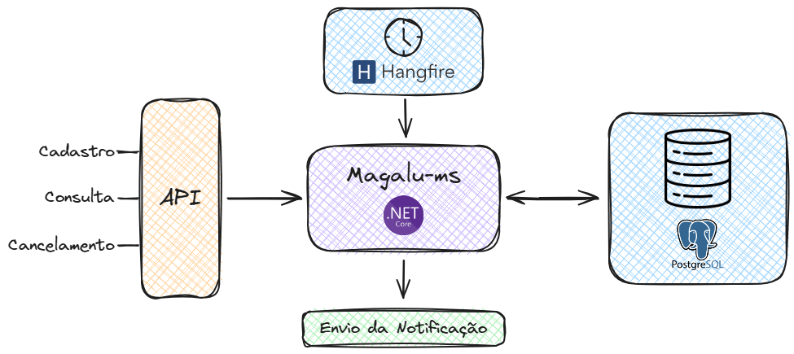

<p align="center" width="100%">
     
</p>


<h3 align="center">
  Desafio Backend da Magalu
</h3>

<p align="center">

  
  
  

</p>

## Overview
This project is a Notification Service developed as part of the Desafio Magalu. It's built using ASP.NET Core and aims to provide a robust API for scheduling, sending, and managing notifications.

<p align="center" width="100%">
     
</p>

## Technologies Used
- **C#** for the backend logic.
- **ASP\.NET Core** for creating the web API.
- **Entity Framework Core** for database operations.
- **Hangfire** for job scheduling.
- **PostgreSQL** as the database.
- **Docker** for running the PostgreSQL database.

## Getting Started

   ### Prerequisites
   - .NET 5.0 SDK or later
   - Visual Studio 2019 or JetBrains Rider 2024.1.4 or later
   - Docker and Docker Compose

   ### Database
   This project uses PostgreSQL as its database, running in a Docker container for development environments.
   1. Ensure Docker and Docker Compose are installed on your machine.
   2. After clone the repository, check if `docker-compose.yml` file in the root directory of the project with the following content:
   ```yaml
   version: "3"
   services:
   db:
      image: postgres
      restart: always
      environment:
         POSTGRES_USER: root
         POSTGRES_PASSWORD: 123
         POSTGRES_DB: magaludb
         TZ: America/Sao_Paulo
      volumes:
         - ./data:/var/lib/postgresql/data
      ports:
         - 5432:5432
   ```

   ### Installation
   1. Clone the repository:
      `https://github.com/GabrielGSD/Desafio-Backend-Magalu`
   2. Navigate to the project directory:
      `cd DesafioMagalu`
   3. Restore the .NET packages:
      `dotnet restore`
   4. Update the database (if using Entity Framework Core):
      `dotnet ef database update`
   5. Start the PostgreSQL database by running:
      `docker-compose up -d`
   6.  Run the command to generate the migrations:
   `dotnet ef migrations add <msg>`
   7. Apply the migrations to the database to create the tables:
   `dotnet ef database update`
   8. Start the application:
      `dotnet run`

---
## Usage
The API supports the following operations:
- **POST /api/notification**: Schedule a new notification.
- **GET /api/notification?notificationId={id}**: Retrieve a notification by its ID.
- **DELETE /api/notification?notificationId={id}**: Cancel a scheduled notification.

## Contributing
Contributions are welcome! Please feel free to submit a pull request or open an issue for any bugs or feature requests.

## Inspiration
This project was inspired by the video tutorial "[Resolvendo DESAFIO BACKEND da Magalu com Spring Boot, Scheduler e MySQL](https://www.youtube.com/watch?v=af4W9Q4vB1s)" from the Build & Run YouTube channel. The concepts and techniques demonstrated in the video were adapted and expanded upon to fit the specific needs and objectives of this project.

The GitHub repository for the solution can be found here: [Build & Run - Repository](https://github.com/buildrun-tech/buildrun-desafio-backend-magalu/)

## Challenge
Check out the full announcement by clicking here: [Desafio Magalu](https://github.com/buildrun-tech/buildrun-desafio-backend-magalu/blob/main/PROBLEM.md).